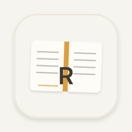

<h4 align="right"><a href="README.md">English</a> | <strong>简体中文</strong></h4>

<div align="center">
  
  <h1>Harbor</h1>
  <div align="center">
    <a href="https://github.com/can4hou6joeng4/Harbor/releases/latest">
      </a>
    <a href="https://github.com/can4hou6joeng4/Harbor/releases">
      </a>
    <a href="https://github.com/can4hou6joeng4/Harbor/stargazers">
      </a>
    
    <a href="https://github.com/can4hou6joeng4/Harbor/actions/workflows/release.yml">
      </a>
  </div>
  <p align="center">本地优先的 Mac 阅读与收藏 —— 抓取、阅读、整理,并用你自带的 AI 做摘要 / 翻译 / 对话 / 二次创作。</p>
</div>

<p align="center">
  
</p>
<p align="center"><sub>▶ <a href="docs/reader-promo.mp4">观看完整宣传片(MP4 · 55s · 全貌 → 采集 → 阅读 → AI)</a></sub></p>

---

## 功能特性

- 🌊 **采集**: URL 正文提取 + 封面、RSS / Atom / JSON 订阅(去重、条件请求、并发同步)、本地 PDF/图片导入
- 📖 **阅读**: 三栏布局、划词高亮与笔记、双语对照、衬线/排版调节、阅读进度与位置记忆
- 📂 **整理**: 标签、树形目录、收藏、SQLite FTS5 全文搜索(中英文)、条目删除、键盘导航
- 🤖 **AI(自带 Key)**: 摘要(结构化)、翻译(逐段保 id)、对话与二次创作(流式输出);结果回流落库,离线可读
- 🏠 **本地优先**: 库 / 高亮 / 笔记 / 阅读位置全部本地持久化;AI 默认关闭、显式开启、绝不自动发送

## 下载安装

### 下载

1. 从 [**Releases**](https://github.com/can4hou6joeng4/Harbor/releases/latest) 下载 `Harbor.dmg`
2. 打开 DMG,把 **Harbor** 拖进 **Applications**
3. **首次打开**: 当前版本未做 Apple 公证,需放行一次 Gatekeeper:在「应用程序」里**右键 Harbor → 打开**,或在终端执行:

   ```bash
   xattr -dr com.apple.quarantine /Applications/Harbor.app
   ```

### Homebrew

```bash
brew install --cask can4hou6joeng4/tap/harbor
```

## 自动更新

App 菜单 **Harbor → 检查更新…** 即可。更新由 [Sparkle](https://sparkle-project.org) 分发,经 EdDSA 签名校验,不必再去网站手动下载。

## 配置 AI(自带 Key)

在应用内「设置」选择 Provider 并填入 Key(**只存 Keychain**):

- **Anthropic 官方**: 默认 `api.anthropic.com`
- **OpenAI**: 官方或兼容端点(Azure、Groq、Together 等)
- **自定义**: 任何 OpenAI 兼容服务,可自定义 base URL

AI 功能:
- **摘要**: 生成结构化摘要
- **翻译**: 逐段翻译,保留段落 ID
- **对话与二次创作**: 流式 AI 响应,结果保存到资料库

所有 AI 结果本地存储,离线可访问。

## 技术栈

- **Swift 6** + **SwiftUI** 原生 macOS 体验
- **GRDB** 本地 SQLite 持久化,FTS5 全文搜索
- **Sparkle** 自动更新框架
- **SSE streaming** 实时 AI 响应流

## 开发

### 环境要求

- macOS 13.0+
- Xcode 16.0+
- Swift 6.0+

### 构建

```bash
# 克隆仓库
git clone https://github.com/can4hou6joeng4/Harbor.git
cd Harbor

# 构建并运行
swift build
swift run

# 或在 Xcode 中打开
open Package.swift
```

### 测试

```bash
swift test
```

### 打包

```bash
./script/package_app.sh
```

生成带代码签名和公证的 DMG(需要 Apple Developer 凭据)。

## 贡献

欢迎贡献!请先阅读 [CONTRIBUTING.md](CONTRIBUTING.md)(如果有贡献指南)。

## 许可证

GPL v3 — 详见 [LICENSE](LICENSE)。

## 致谢

灵感来自:
- [Sparkle](https://sparkle-project.org) — 自动更新框架
- [GRDB](https://github.com/groue/GRDB.swift) — SQLite 工具包
- [Ink & Switch](https://www.inkandswitch.com/) 的本地优先原则

---

<p align="center">为重视隐私和本地控制的知识工作者用心打造</p>
